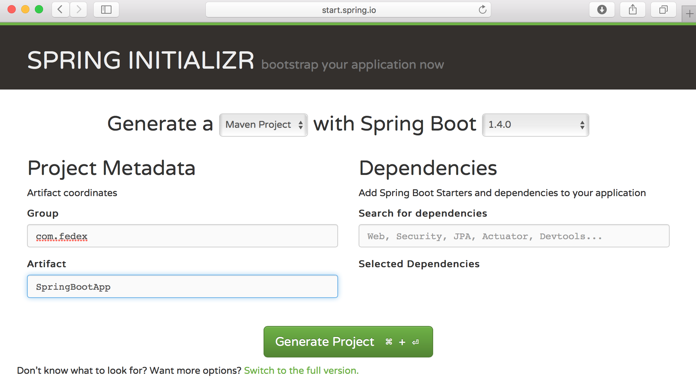

= Lab 6 - [Advanced] Create your own Spring Boot App

[abstract]
--
In this lab you will create your own Spring Boot web application from scratch and deploy it to PCF.  Spring Boot makes it easy and fast to develop Java Apps with Spring.

This is and advanced level lab and will require developing and compiling code.  The instructions assume you know the basics and will skip over standard details.
--

== Requirements
You will need your favorite IDE (i.e., Spring Source Tool Suite - based on Eclipse), Java (JDK) and a build tool (Maven or Gradle).

* https://spring.io/tools/sts
* http://www.oracle.com/technetwork/java/javase/downloads/jdk8-downloads-2133151.html
* https://maven.apache.org/
* https://gradle.org/

== Spring.io

http://spring.io is the home for all things Spring, including Spring Boot.  It includes:

* Documentation
* Getting Started Guides
* Spring Projects
* Q&A and Forum
* Blog

== Spring Boot

Spring Boot makes it easy to create stand-alone, production-grade Spring based Applications that you can "just run". We take an opinionated view of the Spring platform and third-party libraries so you can get started with minimum fuss. Most Spring Boot applications need very little Spring configuration.

== Getting Started - http://start.spring.io

. Go to http://start.spring.io to create and download a template project.
. Select if you want to use 'Maven' or 'Gradle' as your build tool.  (You will need the tool you select installed on your computer)
. Set the group (aka package) you want to use for your project (e.g., 'com.fedex').
. Set the Artifact to the name you want for your project.
. Search for and add the 'Web' and 'Actuator' dependancies.
. Click 'Generate Project'.  This will create the project, zip it up, and download it.
. Go to where you downloaded the zip and unzip it if your OS didn't automatically

== Open and Explore the project in your IDE

. Open your favorite IDE, i.e., STS (Eclipse)
. Import the Maven or Gradle project
.. In Eclipse, with Maven you do: File -> Import -> Maven -> Existing Maven Project and select the project you just downloaded and unzipped.
. Open and explore the build file that was generated for you.  Either pom.xml for Maven or build.gradle for Gradle.
.. Click on the tab (i.e., "pom.xml") to view the raw content.
. Open and explore the one Class that was created for you in 'src/main/java', under the package you specified above.
. Add the requisite hello world message to the end of the main method.
.. `System.out.println("Hello Cloud Native Conference");`
. Run your project
.. Right Click on the project and select "Run as -> Spring Boot Application"
. Check out the logs

== Add a REST controller ==

. Add a new Class or inner Class.
. Annotate the class with `@RestController` to make it a REST Controller.
. Add a method to handle an endpont that returns a String and takes no arguments.
. Annotate the method with '@RequestMapping'.  This will default to the "/" path and 'GET' operation
. Return some message.  E.g., `return "{\"text\":\"Hello Cloud Native Conference in REST\"}";`
. Run or Restart your application
. Navigate in a browser to http://localhost:8080/

== Push the application! ==

----
$ cf push <AppName>
----
